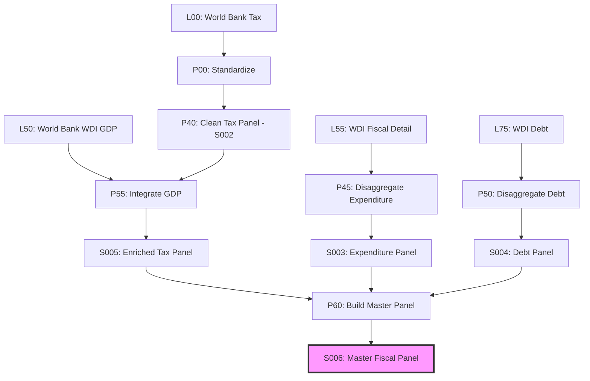

# Decomposition: S006 — Master Fiscal Panel

## Quick Reference

| Field | Value |
|-------|-------|
| Series ID | S006 |
| Name | Master Fiscal Panel |
| Type | Composite (merged panel) |
| Components | S005 (Enriched Tax), S003 (Expenditure), S004 (Debt) |
| Columns | 29 |
| Coverage | 238 countries, 1972-2024 |

## Sub-Components

| Component | Source | Period | Units |
|-----------|--------|--------|-------|
| S005 (Enriched Tax Panel) | World Bank WDI GDP | 1972-2024 | % GDP, USD |
| S003 (Expenditure Panel) | World Bank WDI | 1972-2024 | % GDP |
| S004 (Debt Panel) | World Bank WDI | 1972-2024 | % GDP, % GNI |

## Construction Steps

1. Load S005 (enriched_tax_panel.xlsx) — required input
2. Load S003 (expenditure_panel.xlsx) — optional, left-join on (country_code, year)
3. Load S004 (debt_panel.xlsx) — optional, left-join on (country_code, year)
4. Compute derived columns: fiscal_balance = tax_revenue - expenditure
5. Output to master_fiscal_panel.xlsx (29 columns)

## Construction Diagram

## Source Methodology

The Master Fiscal Panel implements the unified budget constraint identity:

**T - G = -dDebt**

Where:
- T = Tax revenue (% GDP) from World Bank indicator GC.TAX.TOTL.GD.ZS
- G = Government expenditure (% GDP) from World Bank indicator GC.XPN.TOTL.GD.ZS
- Debt = Central government debt (% GDP) from World Bank indicator GC.DOD.TOTL.GD.ZS

The panel merges these three domains via left-join on (country_code, year), preserving all tax-panel rows even where expenditure or debt data is missing.
