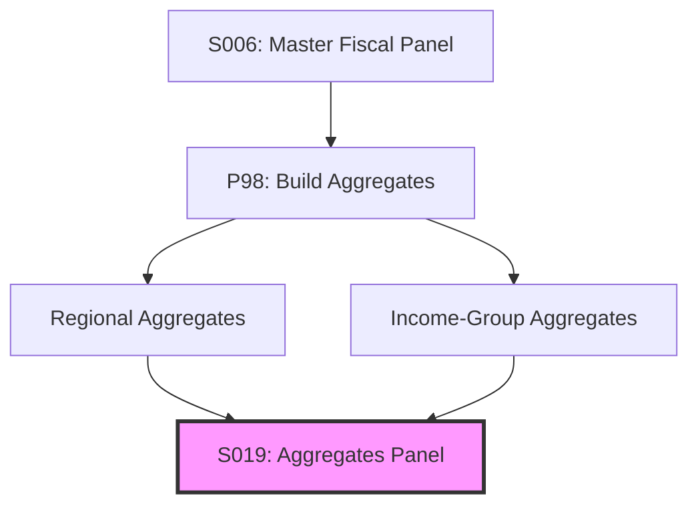

# Decomposition: S019 — Aggregates Panel

## Quick Reference

| Field | Value |
|-------|-------|
| Series ID | S019 |
| Name | Aggregates Panel |
| Type | Composite (aggregated from S006) |
| Components | S006 (Master Fiscal Panel) |
| Coverage | Regional and income-group aggregates |

## Sub-Components

| Component | Source | Period | Units |
|-----------|--------|--------|-------|
| S006 (Master Fiscal Panel) | Composite | 1972-2024 | Mixed |

## Construction Steps

1. Load S006 (master_fiscal_panel.xlsx)
2. Group by World Bank region (East Asia, Europe, Latin America, MENA, South Asia, Sub-Saharan Africa, North America)
3. Group by income class (High, Upper-middle, Lower-middle, Low)
4. Compute mean, median, weighted_mean, min, max for each variable
5. Output to aggregates_panel.xlsx

## Construction Diagram

---

*Decomposition created 2026-05-12 during Anu Framework integration*
